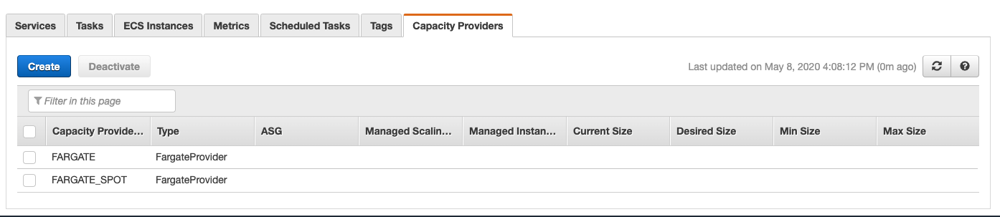
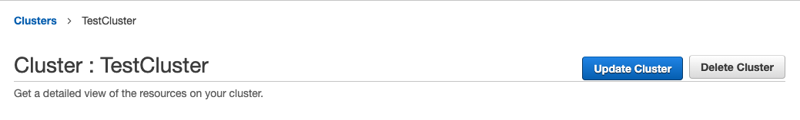
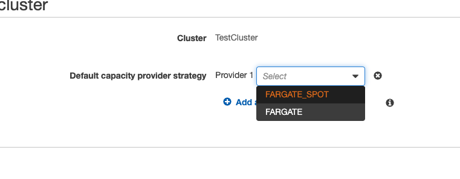
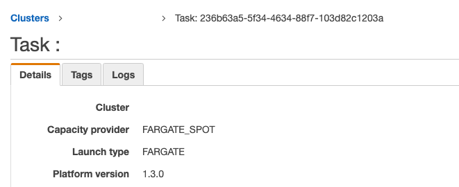

[AWS recently announced a Spot pricing strategy for Fargate tasks](https://aws.amazon.com/blogs/aws/aws-fargate-spot-now-generally-available/), slashing the
costs for development environments and interruptable tasks. Here's how to get
started!

<!-- end -->

If you're not familiar with the concept of Spot Pricing in AWS, I'll try and explain. Spot was initially launched for EC2 instances way back in 2009. You specify your maxmimum "bid" for a given instance type in an availabilty zone, and if your bid is less than the "spot price", the request is fulfilled and you get your instances for a fraction of the sticker price.

There is a catch, though. Spot instances can be terminated with only two minutes warning, making them unsuitable for stateful application servers or databases that may lead to downtime if terminated.

This makes spot a really useful tool for fleets of servers to work on things like transcoding, AI/ML workloads, CI/CD tasks and more. It's also a very attractive proposition for cloud gaming rigs with their new [Spot Blocks](https://aws.amazon.com/blogs/aws/new-ec2-spot-blocks-for-defined-duration-workloads/) functionality (but more on that in another blog post!).

Now, why am I mentioning EC2s and Fargate in the same breath? Well, even though Fargate offers some impressive cost savings over EC2 for containerised workloads, it is still a cost that must be considered. Enter Fargate Spot!

I have begun to use Fargate Spot for my development/test environments and have found them to be super reliable, even with APIs.

Here's how to enable the new feature on your cluster:

### First, verify that the Spot Capacity provider is enabled for your cluster
Head to your cluster in the AWS console and hit "Capacity Providers"

 

Fargate spot should already be available in this list if you are in a supported region.

### Then, update the cluster
Update your cluster by hitting "Update cluster":

 

### Choose the FARGATE_SPOT capacity provider
Click "Add another provider", then choose the `FARGATE_SPOT` capacity provider.

 

Click "Update" to save the changes.

### Now, launch a task into the cluster
You will notice that the task is now using the `FARGATE_SPOT` capacity provider, saving you money!

 

Remember, as these tasks can be terminated at any time, it is advisable to have at least two tasks in a given service to ensure that the application(s) are available, even if a component container is being recycled.

Also, it is not advisable to run databases/caches/anything that is stateful in these Spot containers.

I hope you enjoyed reading this, and hopefully you can save a bit of money in your dev and test environments.