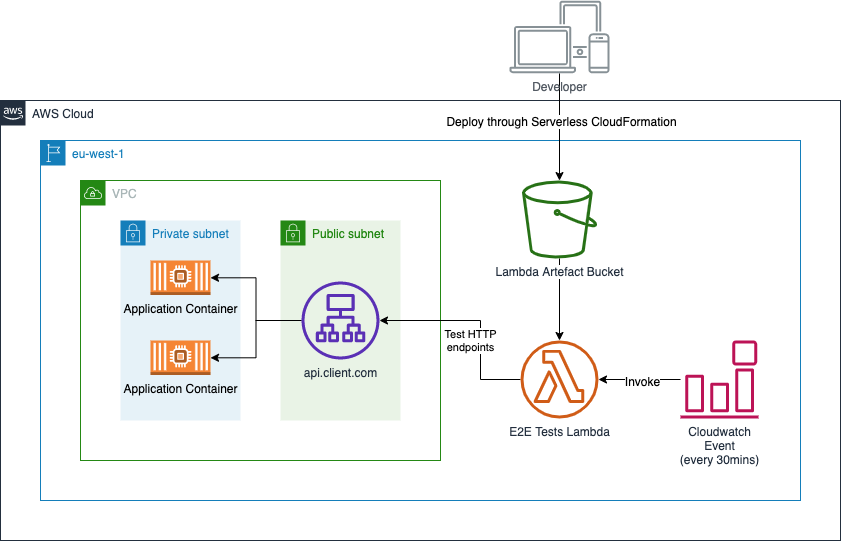

I am working on a task this week to implement some E2E tests for a client cloud
application. As the journies are reasonably straightforward, I thought about how
they could be implemented as a Serverless function.

<!-- end -->

[Serverless](https://serverless.com/) is a framework that aims to make deploying
functions-as-a-service (FaaS) projects straightforward. A deployment bundle
contains a file called `serverless.yml` that contains all of the directives that
the framework uses to create the resources in the cloud. The application code is
also zipped up to form the bulk of the bundle. All of this, in the case of AWS
is then managed by an auto-generated CloudFormation template which dictates the
deployment.

The resulting architecture looks like this:



One of the neat features of the Serverless framework is flexibility when it
comes to dictating the invocation the function. For the E2E tests, I need to be
able to have the tests executed automatically every thirty minutes, to ensure
that the cloud services are working as expected. I can easily achieve this by
declaring the following in my serverless.yml:

```yml
functions:
  login-and-get-account:
    handler: login-and-get-account.e2e
    events:
      - schedule: rate(30 minutes)
```

This will create a CloudWatch Event that will invoke our test at a rate of once
every 30 minutes.

The tests themselves were simple. In the past, I have used Cucumber.js and
Gherkin syntax to produce E2E test libraries and runtimes, but that was too
heavy-handed for this simple use case.

I have seperated the handlers based on the user journey. In the below example,
we are testing the user being able to download information about thier account,
for example in a profile page:

```js
// login-and-get-account.js

"use strict"

const http = require("./lib/helpers/http")
const { info, success, fail } = require("./lib/helpers/log")
const { login } = require("./lib/auth")

let consumerAccessToken

module.exports.e2e = async event => {
  info("Starting E2E test run...")

  try {
    info("Login as consumer...")
    const { accessToken } = await login({
      username: process.env.E2E_USERNAME,
      password: process.env.E2E_PASSWORD,
    })

    consumerAccessToken = accessToken

    success("Got consumer access token!")
  } catch (error) {
    await fail(`Unable to log in as consumer: ${error.message}`)
  }

  try {
    info("Getting account data...")
    const { data: account } = await http.get("/account", {
      headers: {
        Authorization: `Bearer ${consumerAccessToken}`,
      },
    })

    success("Got account data!")

    if (Number(account.widgets) === 0) {
      await fail("Consumer has no widgets!")
    }

    success(`Consumer has ${account.widgets} widgets available`)
  } catch (error) {
    await fail(`Unable to get account data: ${error.message}`)
  }

  return {
    result: "success",
  }
}
```

As you can see, this test is pretty straightforward. We're not doing any
complicated assertions, just making sure that the REST endpoints don't fall over
and that we get some responses.

One of the nice things about setting up your tests as seperate modules (and
therefore, functions) is that you can schedule them seperately. For example, if
I wanted to check people could log in more often than other test, I could use
the following layout in my `serverless.yml`:

```yml
functions:
  login-and-get-account:
    handler: login-and-get-account.e2e
    events:
      - schedule: rate(5 minutes)

  login-and-set-profile-picture:
    handler: login-and-set-profile-picture.e2e
    events:
      - schedule: rate(30 minutes)
```

This means I can give a different level of urgency to my tests. In the above
example, I view logging in and downloading account information as more important
than logging in and changing a profile picture. This urgency and weighting can
be driven from discussions with your product team or customers. In my opinion
every journey should have a criticality associated with it, and that should be
noted somewhere.

I hope this was a useful introduction to using Lambda functions in AWS for E2E
testing of different user journies. All of the code for this example is
available on Github: https://github.com/tomhallam/serverless-e2e-tests
