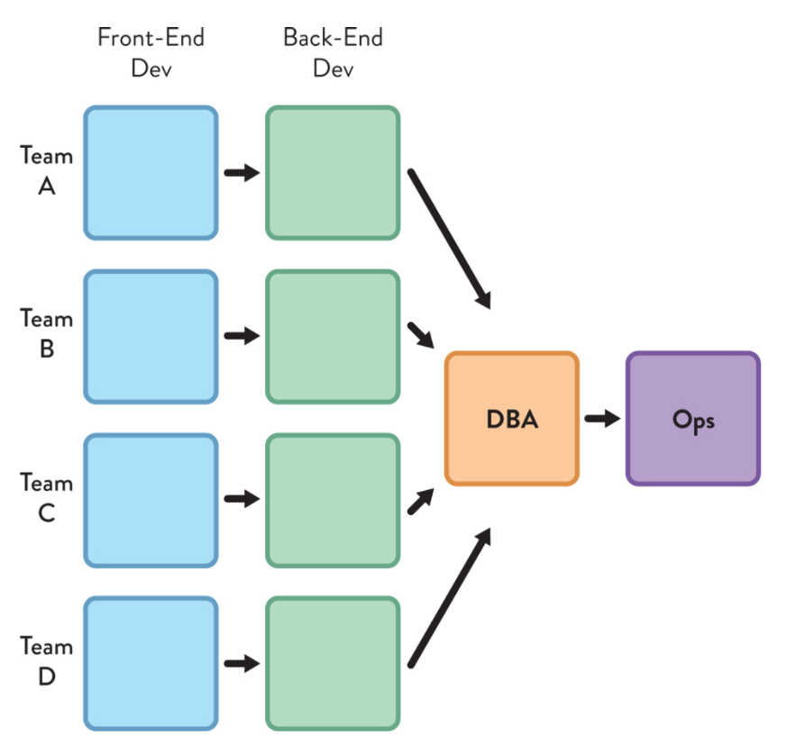

[...] require equal investment in teams and processes as they do in technology.
In this article, I want to distill some of my thoughts around organization
design and how to use this to deliver working software consistently.

<!-- end -->

<blockquote class="blockquote my-4" style="border-left: 5px solid #e7e7e7; padding-left: 15px; color: #666;">

"A software architect is a software expert who makes high-level design choices and dictates technical 
standards, including software coding standards, tools, and platforms."

<footer class="blockquote-footer">Wikipedia - https://en.wikipedia.org/wiki/Software_architect</footer>
</blockquote>

The textbook definition of a software architect is someone who is a subject
matter expert in the relevant software field(s) who can produce high-level
architecture documentation and make choices about how a given software system is
implemented. You'll note that this definition makes it seem the architect's
responsibility is just for the software and outcome. It talks of dictating and
making choices.

It makes sense that the implementation of functional and non-functional
requirements in a given software system should be guided by the architecture.
It's no surprise then, that there are often misgivings from contributors towards
the software architect having worked in a silo to produce a given design without
giving due thought to how these designs affect them. [TODO - Clunky?]

The interesting thing is that the architecture of a system dictates not only the
software itself but the ideal organization structure to realize it. This was
succinctly posited in Mel Conway's 1967 paper "How Do Committees Invent?". His
observation, now known as "Conway's Law" is:

<blockquote class="blockquote" style="border-left: 5px solid #ccc; padding-left: 15px; color: #666;">

"Organizations which design systems are
constrained to produce designs which are copies of the communication
structures of these organizations.”"

<footer class="blockquote-footer">Mel Conway (1968)</footer>
</blockquote>

A fascinating insight! As soon as I thought back through all of the companies I
have worked for and the software we've produced, it struck me that it was bang
on. Here's an example:

I have been reading Manuel Pais and Matthew Skelton's fascinating book, Team
Topologies (Amazon Link), that focuses a discussion around Conway's Law and the
reprocussions of this law on software design.

One of the main points that it makes is that siloed architects or functional silos
often leads to anti-patterns in the software. Anti-patterns like having services
joined by a database, which is fragile and makes reasoning about the
software more complicated.

Worse, it means that adopting modern software delivery techniques like
continuous delivery and integration becomes difficult or even impossible.

So how do we, as software architects, address this?

